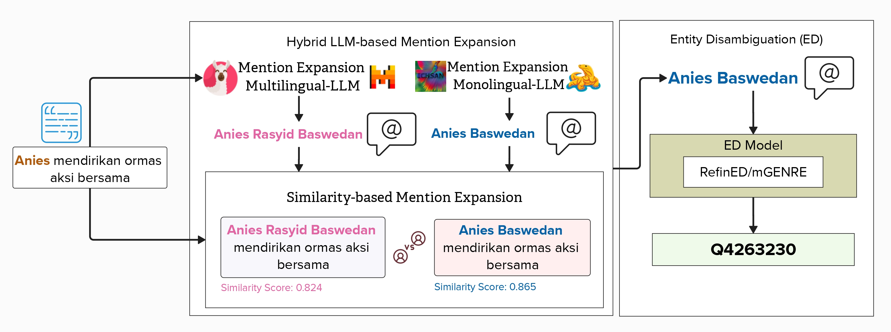

# CELESTA


CELESTA is a hybrid Entity Disambiguation (ED) framework designed for low-resource languages. In a case study on Indonesian, CELESTA performs parallel mention expansion using both multilingual and monolingual Large Language Models (LLMs). It then applies a similarity-based selection mechanism to choose the expansion that is most semantically aligned with the original context. Finally, the selected expansion is linked to a knowledge base entity using an off-the-shelf ED model—without requiring any fine-tuning. The following is the architecture of CELESTA:

<p align="center">

</p>


## 📂 Repository Structure
```
│
├── datasets/                     # Input datasets (IndGEL, IndQEL, IndEL-WIKI)
├── images/                       # Architecture visualizations
│   └── celesta_architecture.jpg
├── src/                          # Source code for CELESTA modules
│   └── mention_expansion/        # Mention expansion scripts
├── requirements.txt              # Python dependencies
├── README.md                     # Project overview
└── LICENSE                       # License file
```

## ⚙️ Installation

1. **Clone the repository**
   ```bash
   git clone https://github.com/dice-group/CELESTA.git
   cd CELESTA ```

2. **Create the environment**
```
conda create -n celesta python=3.10
conda activate celesta
pip install -r requirements.txt
```

## Evaluation Datasets

CELESTA is evaluated on three Indonesian Entity Disambiguation (ED) datasets: **IndGEL**, **IndQEL**, and **IndEL-WIKI**.  
- **IndGEL** (general domain) and **IndQEL** (specific domain) are from the [IndEL dataset](https://link-to-IndEL-dataset).  
- **IndEL-WIKI** is a new dataset we created to provide additional evaluation data for CELESTA.

| Dataset Property             | IndGEL | IndQEL | IndEL-WIKI |
|------------------------------|-------:|-------:|-----------:|
| **Sentences**                | 2,114  | 2,621  | 24,678     |
| **Total entities**           | 4,765  | 2,453  | 24,678     |
| **Unique entities**          | 55     | 16     | 24,678     |
| **Entities / sentence**      | 2.4    | 1.6    | 1.0        |
| **Train set sentences**      | 1,674  | 2,076  | 17,172     |
| **Validation set sentences** | 230    | 284    | 4,958      |
| **Test set sentences**       | 230    | 284    | 4,958      |


## Large Language Models (LLMs)

CELESTA uses **two parallel LLMs**:

- **Multilingual LLMs**
  - [LLaMA-3](https://huggingface.co/meta-llama/Meta-Llama-3-70B-Instruct)
  - [Mistral](https://huggingface.co/mistralai/Mistral-7B-Instruct-v0.3)

- **Indonesian Monolingual LLMs**
  - [Komodo](https://huggingface.co/suayptalha/Komodo-7B-Instruct)
  - [Merak](https://huggingface.co/Ichsan2895/Merak-7B-v4-GGUF)


## 🚀 Usage

1. Run Mention Expansion
```
# Change directory to the src folder
cd src

# To run the mention expansion script
# usage: mention_expansion.py [-h] [--model_name MODEL_NAME] [--prompt_type PROMPT_TYPE] [--dataset DATASET] [--split SPLIT] [--llm_name LLM_NAME] [--input_dir INPUT_DIR]
#                            [--output_dir OUTPUT_DIR] [--batch_size BATCH_SIZE] [--save_every SAVE_EVERY] [--save_interval SAVE_INTERVAL]

python src/mention_expansion.py
```

