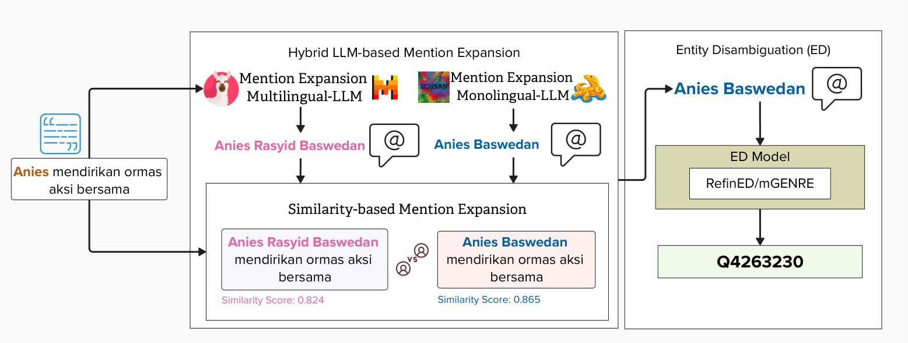

# CELESTA


CELESTA is a hybrid Entity Disambiguation (ED) framework designed for low-resource languages. In a case study on Indonesian, CELESTA performs parallel mention expansion using both multilingual and monolingual Large Language Models (LLMs). It then applies a similarity-based selection mechanism to choose the expansion that is most semantically aligned with the original context. Finally, the selected expansion is linked to a knowledge base entity using an off-the-shelf ED model—without requiring any fine-tuning. The following is the architecture of CELESTA:

<p align="center">

</p>


## 📂 Repository Structure
```
│
├── datasets/                     # Input datasets (IndGEL, IndQEL, IndEL-WIKI)
├── images/                       # Architecture visualizations
│   └── celesta_architecture.jpg
├── src/                          # Source code for CELESTA modules
│   └── mention_expansion/        # Mention expansion scripts
├── requirements.txt              # Python dependencies
├── README.md                     # Project overview
└── LICENSE                       # License file
```

## ⚙️ Installation

1. **Clone the repository**
   ```bash
   git clone https://github.com/dice-group/CELESTA.git
   cd CELESTA ```

2. **Create the environment**
```
conda create -n celesta python=3.10
conda activate celesta
pip install -r requirements.txt
```

## Evaluation

### Datasets

CELESTA is evaluated on three Indonesian Entity Disambiguation (ED) datasets: **IndGEL**, **IndQEL**, and **IndEL-WIKI**.  
- **IndGEL** (general domain) and **IndQEL** (specific domain) are from the [IndEL dataset](https://github.com/dice-group/IndEL).  
- **IndEL-WIKI** is a new dataset we created to provide additional evaluation data for CELESTA.

| Dataset Property             | IndGEL | IndQEL | IndEL-WIKI |
|------------------------------|-------:|-------:|-----------:|
| **Sentences**                | 2,114  | 2,621  | 24,678     |
| **Total entities**           | 4,765  | 2,453  | 24,678     |
| **Unique entities**          | 55     | 16     | 24,678     |
| **Entities / sentence**      | 2.4    | 1.6    | 1.0        |
| **Train set sentences**      | 1,674  | 2,076  | 17,172     |
| **Validation set sentences** | 230    | 284    | 4,958      |
| **Test set sentences**       | 230    | 284    | 4,958      |


### Large Language Models (LLMs)

CELESTA uses **two hybrid LLMs**:

- **Multilingual LLMs**
  - [LLaMA-3](https://huggingface.co/meta-llama/Meta-Llama-3-70B-Instruct)
  - [Mistral](https://huggingface.co/mistralai/Mistral-7B-Instruct-v0.3)

- **Indonesian Monolingual LLMs**
  - [Komodo](https://huggingface.co/suayptalha/Komodo-7B-Instruct)
  - [Merak](https://huggingface.co/Ichsan2895/Merak-7B-v4-GGUF)

## 🚀 Usage
### Mention Expansion
1. Run Mention Expansion
```
# Change directory to the src folder
cd src

# To run the mention expansion script
# usage: mention_expansion.py [-h] [--model_name MODEL_NAME] [--prompt_type PROMPT_TYPE] [--dataset DATASET] [--split SPLIT] [--llm_name LLM_NAME] [--input_dir INPUT_DIR]
#                            [--output_dir OUTPUT_DIR] [--batch_size BATCH_SIZE] [--save_every SAVE_EVERY] [--save_interval SAVE_INTERVAL]

python mention_expansion.py --model_name meta-llama/Meta-Llama-3-70B-Instruct --prompt_type few-shot --dataset IndGEL --llm_name llama-3

```

2. Entity Disambiguation
### Entity Disambiguation with mGENRE
```
# Run script to CELESTA-mGENRE
bash run-CELESTA-mGENRE.sh
```

## Results
The table below compares CELESTA with two baseline ED models (ReFinED and mGENRE) across the three evaluation datasets. **Bold** values indicate the highest score for each metric within a dataset.

| Dataset     | Model            | Precision | Recall  | F1      |
|-------------|------------------|-----------|---------|---------|
| **IndGEL**  | ReFinED          | 0.749     | 0.547   | 0.633   |
|             | mGENRE           | 0.742     | 0.718   | 0.730   |
|             | **CELESTA (ours)** | **0.748** | **0.722** | **0.735** |
| **IndQEL**  | ReFinED          | 0.208     | 0.160   | 0.181   |
|             | mGENRE           | **0.298** | **0.298** | **0.298** |
|             | **CELESTA (ours)** | **0.298** | **0.298** | **0.298** |
| **IndEL-WIKI** | ReFinED       | **0.627** | 0.327   | 0.430   |
|             | mGENRE           | 0.601     | **0.489** | **0.539** |
|             | **CELESTA (ours)** | 0.595     | 0.495   | 0.540   |


<p>
  The table below reports Precision (P), Recall (R), and F1 for CELESTA and individual LLM configurations across the three datasets, under <b>zero-shot</b> and <b>few-shot</b> prompting.<br>
  <b>Bold</b> values indicate the highest F1 score within each dataset and prompting setting. Shaded rows highlight CELESTA results.
</p>

<table>
<thead>
<tr>
<th rowspan="2">Dataset</th>
<th rowspan="2">Model</th>
<th colspan="3">Zero-shot</th>
<th colspan="3">Few-shot</th>
</tr>
<tr>
<th>P</th><th>R</th><th>F1</th>
<th>P</th><th>R</th><th>F1</th>
</tr>
</thead>
<tbody>

<!-- IndGEL -->
<tr>
<td rowspan="9"><b>IndGEL</b></td>
<td>LLaMA-3</td><td>0.727</td><td><b>0.499</b></td><td><b>0.592</b></td><td>0.777</td><td>0.531</td><td>0.631</td>
</tr>
<tr><td>Mistral</td><td>0.699</td><td>0.411</td><td>0.517</td><td><b>0.806</b></td><td>0.310</td><td>0.448</td></tr>
<tr><td>Komodo</td><td>0.709</td><td>0.447</td><td>0.548</td><td>0.704</td><td>0.527</td><td>0.603</td></tr>
<tr><td>Merak</td><td>0.654</td><td>0.441</td><td>0.526</td><td>0.749</td><td>0.547</td><td>0.633</td></tr>

<tr style="background-color:#f0f0f0">
<td colspan="7"><b>CELESTA with ReFinED</b></td>
</tr>

<tr><td>LLaMA-3 & Komodo</td><td><b>0.731</b></td><td>0.437</td><td>0.547</td><td>0.757</td><td>0.513</td><td>0.612</td></tr>
<tr><td>LLaMA-3 & Merak</td><td>0.688</td><td>0.431</td><td>0.530</td><td>0.802</td><td><b>0.586</b></td><td><b>0.677</b></td></tr>
<tr><td>Mistral & Komodo</td><td>0.719</td><td>0.390</td><td>0.506</td><td>0.781</td><td>0.344</td><td>0.478</td></tr>
<tr><td>Mistral & Merak</td><td>0.678</td><td>0.402</td><td>0.505</td><td>0.779</td><td>0.503</td><td>0.611</td></tr>

<!-- IndQEL -->
<tr>
<td rowspan="9"><b>IndQEL</b></td>
<td>LLaMA-3</td><td>0.154</td><td>0.051</td><td>0.077</td><td><b>0.327</b></td><td>0.058</td><td>0.099</td>
</tr>
<tr><td>Mistral</td><td>0.179</td><td>0.131</td><td>0.151</td><td>0.072</td><td>0.029</td><td>0.042</td></tr>
<tr><td>Komodo</td><td>0.158</td><td>0.116</td><td>0.134</td><td>0.208</td><td><b>0.160</b></td><td><b>0.181</b></td></tr>
<tr><td>Merak</td><td><b>0.203</b></td><td><b>0.149</b></td><td><b>0.172</b></td><td>0.142</td><td>0.106</td><td>0.121</td></tr>

<tr style="background-color:#f0f0f0">
<td colspan="7"><b>CELESTA with ReFinED</b></td>
</tr>

<tr><td>LLaMA-3 & Komodo</td><td>0.138</td><td>0.047</td><td>0.071</td><td>0.282</td><td>0.073</td><td>0.116</td></tr>
<tr><td>LLaMA-3 & Merak</td><td>0.160</td><td>0.113</td><td>0.132</td><td>0.130</td><td>0.098</td><td>0.112</td></tr>
<tr><td>Mistral & Komodo</td><td>0.138</td><td>0.095</td><td>0.112</td><td>0.107</td><td>0.047</td><td>0.066</td></tr>
<tr><td>Mistral & Merak</td><td>0.196</td><td>0.146</td><td>0.167</td><td>0.128</td><td>0.095</td><td>0.109</td></tr>

<!-- IndEL-WIKI -->
<tr>
<td rowspan="9"><b>IndEL-WIKI</b></td>
<td>LLaMA-3</td><td>0.581</td><td>0.234</td><td>0.332</td><td>0.639</td><td>0.322</td><td>0.428</td>
</tr>
<tr><td>Mistral</td><td>0.565</td><td>0.232</td><td>0.329</td><td>0.552</td><td>0.201</td><td>0.294</td></tr>
<tr><td>Komodo</td><td>0.592</td><td>0.256</td><td>0.357</td><td>0.591</td><td>0.270</td><td>0.370</td></tr>
<tr><td>Merak</td><td>0.591</td><td><b>0.285</b></td><td><b>0.385</b></td><td>0.548</td><td>0.293</td><td>0.382</td></tr>

<tr style="background-color:#f0f0f0">
<td colspan="7"><b>CELESTA with ReFinED</b></td>
</tr>

<tr><td>LLaMA-3 & Komodo</td><td>0.577</td><td>0.234</td><td>0.332</td><td>0.639</td><td>0.322</td><td>0.428</td></tr>
<tr><td>LLaMA-3 & Merak</td><td><b>0.596</b></td><td>0.273</td><td>0.374</td><td><b>0.641</b></td><td><b>0.355</b></td><td><b>0.457</b></td></tr>
<tr><td>Mistral & Komodo</td><td>0.576</td><td>0.231</td><td>0.330</td><td>0.575</td><td>0.219</td><td>0.317</td></tr>
<tr><td>Mistral & Merak</td><td>0.564</td><td>0.248</td><td>0.345</td><td>0.581</td><td>0.270</td><td>0.369</td></tr>

</tbody>
</table>

